# Project Bedrock - Retail Store EKS Microservices Capstone

Highly available, production-grade microservices deployment running on AWS EKS, automated completely through HashiCorp Terraform.

## Architecture Overview

- **Network:** VPC across 2 AZs with public/private subnets and NAT Gateway
- **Orchestration:** Amazon EKS Cluster v1.34 with CloudWatch control plane logging
- **Data Layer:** RDS MySQL (catalog), RDS PostgreSQL (orders), DynamoDB (carts)
- **Ingress:** AWS ALB Controller routing traffic to UI service
- **Observability:** FluentBit + CloudWatch Agent on all nodes
- **Serverless:** S3 upload triggers Lambda to CloudWatch Logs
- **CI/CD:** GitHub Actions - terraform plan on PR, terraform apply on merge


---

## Terraform File Structure

| File | Purpose |
|------|---------|
| vpc.tf | VPC, 2 AZ subnets, NAT Gateway |
| eks.tf | EKS cluster v1.34, managed node groups, DynamoDB/XRay IAM |
| rds.tf | MySQL and PostgreSQL in private subnets, K8s secrets |
| dynamodb.tf | Cart service DynamoDB table with GSI |
| apps.tf | Helm deployments, ALB Controller, ingress, CloudWatch addon |
| tls.tf | cert-manager, Let's Encrypt ClusterIssuer |
| certificate.tf | TLS certificate via null_resource kubectl apply |
| backend.tf | S3 remote state, encryption |
| iam_developer.tf | Developer IAM user, RBAC, S3 permissions, console login |
| monitoring.tf | SNS alerts, CloudWatch alarms |
| serverless.tf | S3 bucket, Lambda, S3 event trigger |
| helm_provider.tf | Helm auth via EKS OIDC |
| kubernetes_provider.tf | Kubernetes auth via EKS OIDC |
| providers.tf | AWS, Kubernetes, Helm, Time providers |
| outputs.tf | Terraform outputs for grading.json |
| variables.tf | Input variable definitions |

---

## Infrastructure Details

- Region: us-east-1
- VPC: project-bedrock-vpc - 10.0.0.0/16
- EKS: project-bedrock-cluster - v1.34 - t3.small nodes (3 nodes)
- RDS MySQL: bedrock-mysql (catalog service)
- RDS PostgreSQL: bedrock-postgres (orders service)
- DynamoDB: items table with GSI idx_global_customerId (carts service)
- S3 State: bedrock-tfstate-hassan-alt-soe-025-4423
- S3 Assets: bedrock-assets-hassan-alt-soe-025-4423
- Lambda: bedrock-asset-processor (Python 3.11)
- Tag: Project: karatu-2025-capstone

---

## Application Access

| Endpoint | URL |
|----------|-----|
| HTTP | http://altsoe0254423.ddns.net |
| ALB | k8s-bedrockretail-3bf7b782f8-1779842580.us-east-1.elb.amazonaws.com |

### Running Pods (retail-app namespace)

| Pod | Database |
|-----|----------|
| ui | N/A |
| catalog | RDS MySQL |
| orders | RDS PostgreSQL |
| carts | DynamoDB |
| checkout | N/A (in-memory) |
| checkout-redis | N/A |

---

## CI/CD Pipeline

Workflow: `.github/workflows/CI_CD.yml`

- Pull Request → terraform plan (output posted as PR comment)
- Merge to Main → kubectl setup → terraform apply → grading.json auto-committed

GitHub Secrets Required:
- `AWS_ACCESS_KEY_ID`
- `AWS_SECRET_ACCESS_KEY`

### Trigger Methods

```
# Push to Main
git add .
git commit -m "feat: description"
git push origin main

# GitHub UI
Actions → Terraform CI/CD → Run workflow → main

# GitHub CLI
gh workflow run CI_CD.yml --ref main

Terraform Remote State
bucket: bedrock-tfstate-hassan-alt-soe-025-4423
key: stage/bedrock-infra/terraform.tfstate
region: us-east-1
encrypt: true

cd terraform && terraform init

First Time Setup

git clone https://github.com/lilsharkszn/project-bedrock.git
cd project-bedrock/terraform
terraform init
terraform apply

Post-Apply Steps

# Configure kubectl
aws eks update-kubeconfig \
  --name project-bedrock-cluster \
  --region us-east-1

# Grant admin kubectl access
aws eks create-access-entry \
  --cluster-name project-bedrock-cluster \
  --principal-arn arn:aws:iam::986263532474:user/bedrock-admin \
  --type STANDARD

aws eks associate-access-policy \
  --cluster-name project-bedrock-cluster \
  --principal-arn arn:aws:iam::986263532474:user/bedrock-admin \
  --policy-arn arn:aws:eks::aws:cluster-access-policy/AmazonEKSClusterAdminPolicy \
  --access-scope type=cluster


# Verify
kubectl get pods -n retail-app

Helm Manual Deployment (Bonus 5.1)

Developer Access - bedrock-dev-view

Access TypePermission
AWS ConsoleReadOnlyAccess
S3 Buckets3:PutObject on assets bucket
KubernetesClusterRole/view (read-only)
RBAC Verification

# Should return yes
kubectl auth can-i get pods -n retail-app --as bedrock-dev-view
kubectl auth can-i get deployments -n retail-app --as bedrock-dev-view

# Should return no
kubectl auth can-i delete pods -n retail-app --as bedrock-dev-view
kubectl auth can-i create pods -n retail-app --as bedrock-dev-view

Observability
Control Plane Logs enabled: API, Audit, Authenticator, ControllerManager, Scheduler

kubectl get pods -n amazon-cloudwatch
aws logs tail /aws/lambda/bedrock-asset-processor --since 5m

Serverless - S3 + Lambda

Bucket: bedrock-assets-hassan-alt-soe-025-4423
Lambda: bedrock-asset-processor (Python 3.11)
Trigger: S3 PutObject → Lambda → logs Image received: [filename]

Note on S3 Bucket Naming: The original bucket name (bedrock-assets-alt-soe-025-4423) was created on a prior AWS account that was disabled. Since S3 bucket names are globally unique and cannot be reclaimed, the bucket was renamed with a hassan prefix while retaining the student ID suffix. All functionality is fully operational.

aws s3 cp /etc/hostname s3://bedrock-assets-hassan-alt-soe-025-4423/test.txt
aws logs tail /aws/lambda/bedrock-asset-processor --since 1m

TLS / HTTPS
Implementation
cert-manager is installed and a ClusterIssuer (letsencrypt-prod) is configured via HTTP-01 challenge.
Current Status: HTTP fully operational. HTTPS blocked by free DNS provider limitation — NoIP free tier does not allow the additional CNAME record required for ACM certificate DNS validation. Full HTTPS would be immediately achievable with Route 53 or any DNS provider supporting custom CNAME records.

cert-manager Verification

kubectl get pods -n cert-manager
kubectl get clusterissuer

Verification Commands

# All pods
kubectl get pods -n retail-app

# EKS cluster
aws eks describe-cluster --name project-bedrock-cluster \
  --query 'cluster.{Name:name,Version:version,Status:status}' --output table

# VPC
aws ec2 describe-vpcs --vpc-ids <VPC_ID> \
  --query 'Vpcs[0].{ID:VpcId,Name:Tags[?Key==`Name`].Value|[0],State:State}' --output table

# HTTP 200
curl -s -o /dev/null -w "%{http_code}" http://altsoe0254423.ddns.net

# Lambda
aws lambda get-function --function-name bedrock-asset-processor \
  --query 'Configuration.{Name:FunctionName,State:State,Runtime:Runtime}' --output table

# S3 trigger test
aws s3 cp /etc/hostname s3://bedrock-assets-hassan-alt-soe-025-4423/testfile.txt
aws logs tail /aws/lambda/bedrock-asset-processor --since 2m

# Control plane logging
aws eks describe-cluster --name project-bedrock-cluster \
  --query 'cluster.logging' --output json

# IAM user policies
aws iam list-attached-user-policies --user-name bedrock-dev-view --output table

# Resource tagging
aws eks describe-cluster --name project-bedrock-cluster \
  --query 'cluster.tags' --output table

Troubleshooting

IssueFix
Pods pendingkubectl describe pod <name> -n retail-app
DB connection failsCheck RDS security group allows EKS node security group
Ingress no ADDRESSCheck ALB controller logs in kube-system
carts CrashLoopVerify DynamoDB GSI idx_global_customerId exists
kubectl UnauthorizedRun aws eks create-access-entry for your IAM user
State lock stuckterraform force-unlock <LOCK_ID>
CI/CD kubectl errorEnsure kubeconfig step runs before terraform apply
```

Screenshots and Proof of Deployment

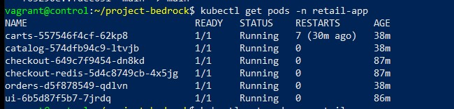

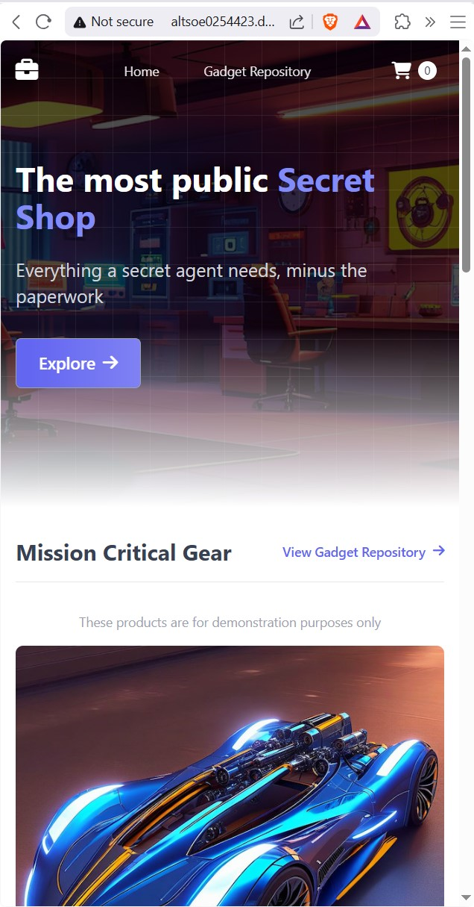


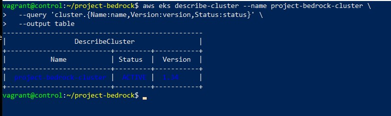

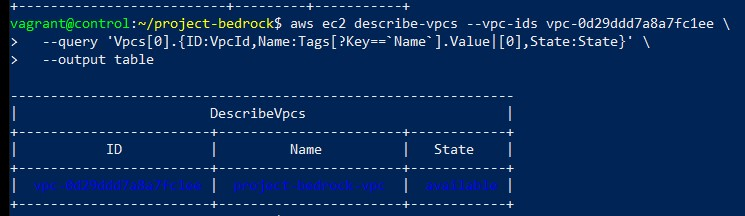

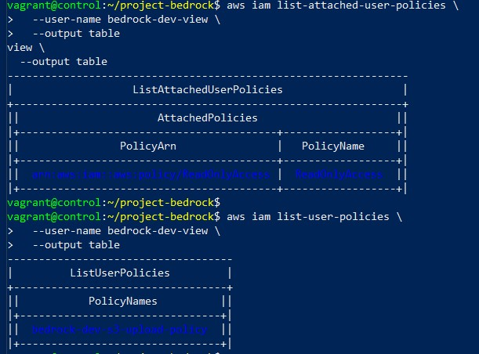

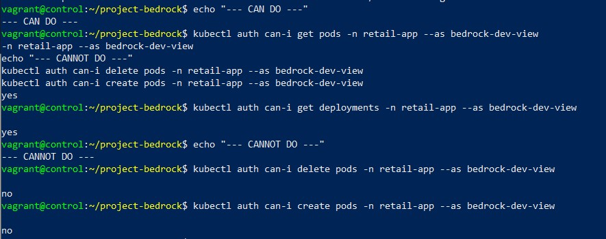

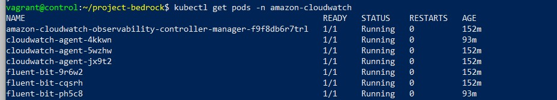

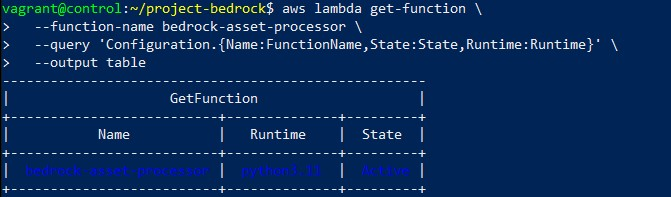

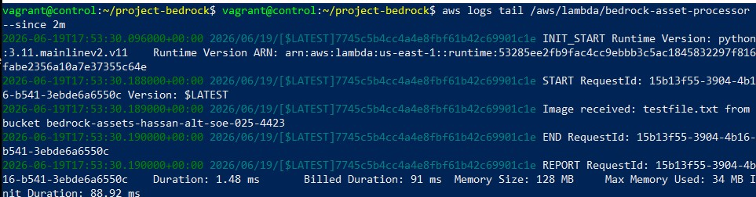

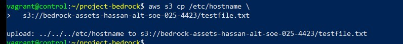

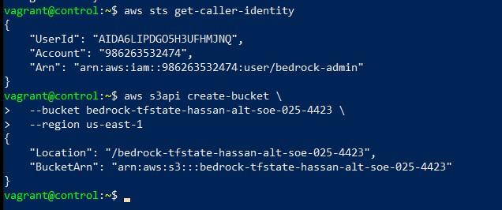

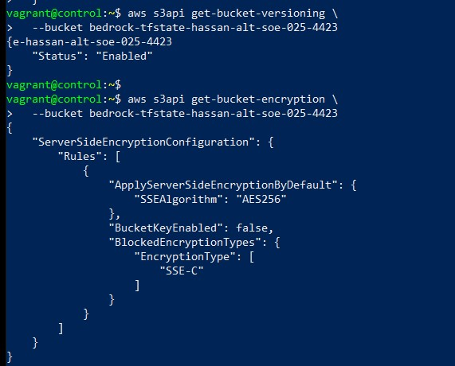

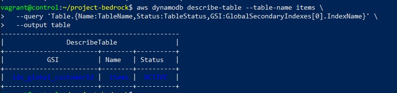

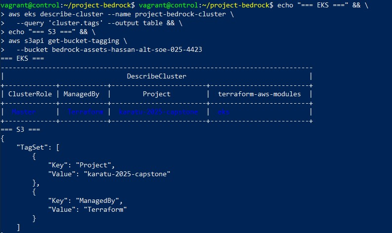

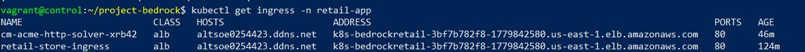

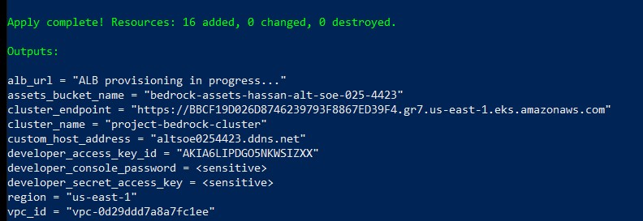

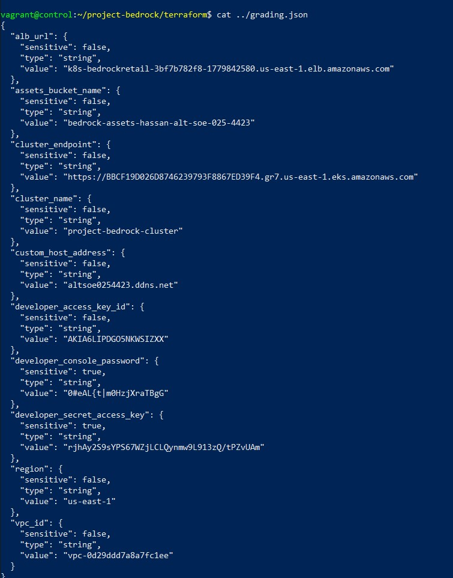

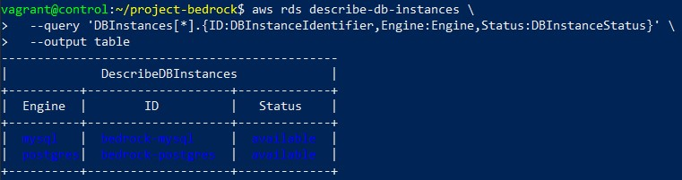

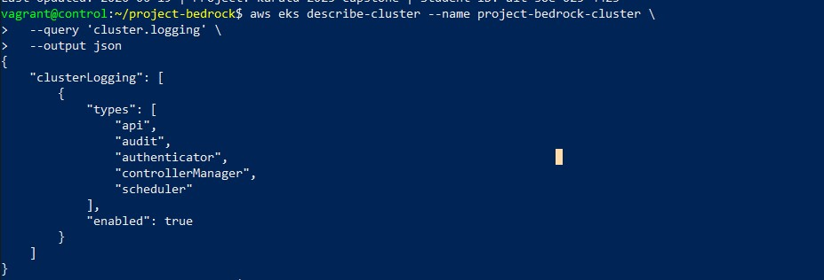

grading.json
Generated with:

terraform output -json > grading.json
Committed to root of repository. Developer credentials redacted in repo - see submission document for actual values.

Last Updated: 2026-06-19 | Project: karatu-2025-capstone | Student ID: alt-soe-025-4423 
# CI/CD verified Fri Jun 19 20:12:04 WAT 2026
