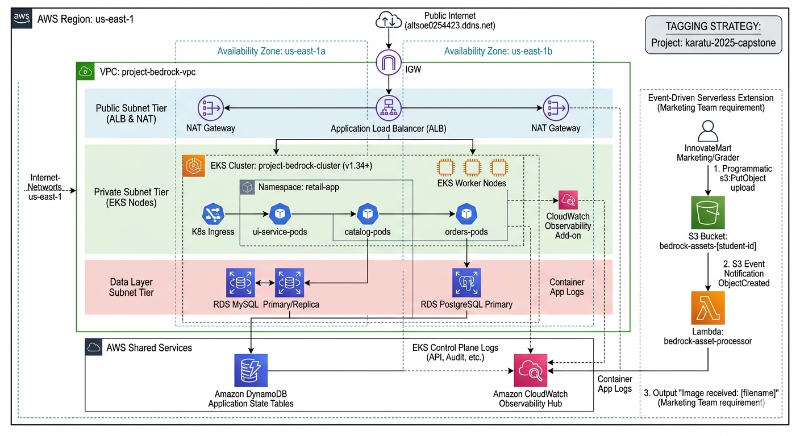

# Project Bedrock - Retail Store EKS Microservices Capstone
............................................................

Highly available, production-grade microservices deployment running on AWS EKS, automated completely through HashiCorp Terraform.

## 🏗️ Architecture Design Overview

* **Network Infrastructure:** VPC isolated across 2 Availability Zones containing explicit public/private subnets and shared NAT Gateway routing.
* **Orchestration:** Managed Amazon EKS Cluster (v1.34) utilizing secure Native Access Entries (`API_AND_CONFIG_MAP`) and CloudWatch control plane log stream visibility.
* **Storage & Application Data Layers:** Relational tier powered by Amazon RDS (MySQL/PostgreSQL) isolated in private subnets, with high-performance state storage handled by Amazon DynamoDB.
* **Ingress Management:** Dynamic external routing via AWS Application Load Balancer (ALB) Controller maps external port `80` traffic to the front-facing UI service layer.



---

## 🛠️ Deployment Configuration Engine

Infrastructure configurations split across logical files in `./terraform`:

| File | Purpose |
|------|---------|
| `vpc.tf` | VPC, 2 AZ subnets, NAT Gateway |
| `eks.tf` | EKS cluster v1.34, managed node groups |
| `rds.tf` | MySQL & PostgreSQL in private subnets |
| `dynamodb.tf` | Cart service state table |
| `apps.tf` | Helm deployments, ALB Controller, ingress routing |
| `backend.tf` | S3 remote state, encryption, state locking |
| `iam_developer.tf` | Developer user, read-only access, S3 permissions |
| `monitoring.tf` | CloudWatch alarms, SNS alerts |
| `helm_provider.tf` | Helm auth via EKS OIDC |
| `kubernetes_provider.tf` | Kubernetes auth via EKS OIDC |

**Network:** VPC `10.0.0.0/16` → Private: `10.0.1-2.0/24` (2 AZs) | Public: `10.0.101-102.0/24`

**Kubernetes:** Cluster `project-bedrock-cluster`, v1.34, 1-3 nodes (min 1, desired 2, max 3), t3.small on AL2023

**Storage:** MySQL `bedrock-mysql` (orders DB) | PostgreSQL `bedrock-postgres` (retaildb) | DynamoDB `items` table (on-demand)

---

## 🚀 CI/CD Pipeline

**Workflow:** `.github/workflows/CI_CD.yml` (triggers on push to `main` or manual dispatch)

```
Checkout → Terraform Setup → Validate Secrets → Init → Validate → Apply → Export grading.json
```

**Environment Variables:**
- `AWS_ACCESS_KEY_ID` - GitHub Secret
- `AWS_SECRET_ACCESS_KEY` - GitHub Secret
- `AWS_DEFAULT_REGION` - us-east-1

**Output:** `grading.json` contains cluster endpoint, VPC ID, ALB URL, developer credentials

---

## 🌐 Application Access & Verification

**Production Endpoint:** `http://altsoe0254423.ddns.net/`

**Verify Deployments:**
```bash
# List Helm releases
helm list --all-namespaces

# Check ingress status
kubectl get ingress -n retail-app
kubectl describe ingress retail-store-ingress -n retail-app

# View ALB URL (if DNS down)
grep alb_url grading.json
```

**Developer Access:** User `bedrock-dev-view` has ReadOnly access + S3 upload permissions. Credentials in `grading.json`.

---

## 🔐 Terraform Backend Setup

**Remote State Configuration** (`terraform/backend.tf`):

```hcl
terraform {
  backend "s3" {
    bucket       = "bedrock-tf-state-alt-soe-025-4423"
    key          = "stage/bedrock-infra/terraform.tfstate"
    region       = "us-east-1"
    encrypt      = true
    use_lockfile = true
  }
}
```

**How It Works:**
- State stored encrypted in S3 bucket
- State locking prevents concurrent applies (via S3)
- Initialize locally: `cd terraform && terraform init`
- View state: `terraform state list` | `terraform state show <resource>`
- Pull/push (use caution): `terraform state pull/push`

**Troubleshooting:** If locked: `terraform force-unlock <LOCK_ID>`

---

## 🔑 RBAC & Access Control

**Dual-Layer Model:**

### AWS IAM Access

**GitHub Actions Service Principal:**
- Credentials: `AWS_ACCESS_KEY_ID` + `AWS_SECRET_ACCESS_KEY` from secrets
- Permissions: Full `ec2:*`, `eks:*`, `rds:*`, `dynamodb:*`, `iam:*`, `s3:*`, `sns:*`

**Developer User (`bedrock-dev-view`):**
- Managed Policy: `ReadOnlyAccess` (describe/list/get all services)
- Custom Policy: S3 PutObject to `bedrock-assets-${student_id}/*`
- Programmatic keys in `grading.json`

### Kubernetes RBAC (IRSA Model)

**ALB Controller** uses IAM Roles for Service Accounts (OIDC-federated):
1. ServiceAccount in `kube-system` annotated with IAM role ARN
2. Pod presents OIDC token to AWS STS
3. STS validates via EKS OIDC provider → issues temp credentials
4. Pod uses credentials to manage ALB, target groups, ingress

**Microservices** use default ServiceAccount (no special RBAC needed—they don't call K8s API)

---

## 📍 Namespace Configuration

**Primary Namespace:** `retail-app`

All microservices deployed here:
```bash
kubectl get pods -n retail-app
# catalog, retail-store-orders, ui, carts

kubectl get svc -n retail-app
# catalog, checkout, orders, ui (ClusterIP services)

kubectl get ingress -n retail-app
# retail-store-ingress (routes to ui via ALB)
```

**Cross-cluster communication** uses internal DNS: `catalog.retail-app.svc.cluster.local:8080`

---

## 📦 Application Helm Packaging & Manual Deployment

The retail store front-end and back-end microservices are modularly packaged as Helm charts stored directly within this repository under the `apps/` ecosystem.

While primary deployment automation is managed via Terraform (`apps.tf`), the entire microservices stack can be manually installed, upgraded, or recovered using a single command with our custom configuration values:

```bash
# Execute from the repository root to deploy the entire stack with your bedrock overrides
helm upgrade --install bedrock-retail ./apps/retail-store-sample-app \
  --namespace retail-app \
  --create-namespace \
  --values ./apps/retail-store-sample-app/bedrock-values.yaml
```

### Helm Values Configuration

The `bedrock-values.yaml` file configures database endpoints:

```yaml
catalog:
  postgresql:
    enabled: false  # Use RDS, not in-cluster
  db:
    endpoint: bedrock-postgres.cozk2e2oeu9c.us-east-1.rds.amazonaws.com:5432
    name: retaildb

orders:
  mysql:
    enabled: false  # Use RDS, not in-cluster
  db:
    endpoint: bedrock-mysql.cozk2e2oeu9c.us-east-1.rds.amazonaws.com:3306
    name: orders

carts:
  dynamodb:
    enabled: false  # Use real DynamoDB, not mock

resources:
  requests:
    memory: "128Mi"
    cpu: "100m"
```

### Deployed Services

| Service | Namespace | Database |
|---------|-----------|----------|
| **Catalog** | `retail-app` | PostgreSQL (RDS) |
| **Orders** | `retail-app` | MySQL (RDS) |
| **UI** | `retail-app` | N/A |
| **Carts** | `retail-app` | DynamoDB |

**Helm Release Management:**
```bash
# List releases
helm list -n retail-app

# Get release values
helm get values catalog -n retail-app

# Upgrade single service
helm upgrade catalog ./apps/retail-store-sample-app/src/catalog/chart \
  -n retail-app -f ./apps/retail-store-sample-app/bedrock-values.yaml

# Rollback to previous release
helm rollback catalog 1 -n retail-app
```

**Verification:**
```bash
helm list --all-namespaces
```

---

## 🔐 Provider Authentication

**AWS Provider:**
- Credentials from GitHub Secrets (CI/CD) or `~/.aws/credentials` (local)
- Auto-tags all resources with `Project: karatu-2025-capstone` and `ManagedBy: Terraform`

**Kubernetes & Helm Providers:**
- **No kubeconfig file needed** - uses EKS OIDC tokens
- `kubernetes_provider.tf` & `helm_provider.tf` call `aws eks get-token` command
- Tokens auto-refresh per request (15 min expiry)

**Local Development:**
```bash
aws configure
aws eks update-kubeconfig --region us-east-1 --name project-bedrock-cluster
terraform init && terraform plan
```

---

## 🚀 How to Trigger the CI/CD Pipeline

The deployment pipeline is fully automated via GitHub Actions and configured as a continuous delivery engine. To manually trigger a fresh compilation and deployment execution:

### Method 1: Push to Main (Automatic)
```bash
git add .
git commit -m "feat: description"
git push origin main
# Pipeline auto-triggers
```

### Method 2: GitHub UI
Navigate to `Actions → Terraform CI/CD → Run workflow → Select branch main`

### Method 3: GitHub CLI
```bash
gh workflow run CI_CD.yml --ref main
gh run list --workflow CI_CD.yml
gh run watch <RUN_ID>
```

**Rollback:** Revert commit or run `terraform destroy` + `terraform apply`

---

## 🛠️ Deployment Verification

To audit your running releases across your EKS namespaces, execute:

```bash
helm list --all-namespaces
```

---

## 📦 Helm & Kustomize Usage

### Current Helm Setup (via Terraform)

**Terraform manages Helm releases** (`terraform/apps.tf`):
```hcl
resource "helm_release" "retail_store_catalog" {
  name             = "catalog"
  chart            = "../apps/retail-store-sample-app/src/catalog/chart"
  namespace        = "retail-app"
  values = [file("${path.module}/../apps/retail-store-sample-app/bedrock-values.yaml")]
}
```

### Kustomize (Optional Future Enhancement)

Kustomize can be layered on top of Helm for environment-specific customizations (dev/staging/prod) without modifying base charts.

---

## 🔧 Quick Troubleshooting

| Issue | Check |
|-------|-------|
| Pods pending/crashing | `kubectl describe pod <name> -n retail-app` + `kubectl logs <name> -n retail-app` |
| DB connection fails | Verify `bedrock-values.yaml` endpoints. RDS security group allows EKS nodes? |
| Ingress shows `<pending>` | ALB Controller running? `kubectl get deploy -n kube-system aws-load-balancer-controller` |
| Terraform secrets empty | GitHub Secrets correctly named: `AWS_ACCESS_KEY_ID`, `AWS_SECRET_ACCESS_KEY` |
| State lock stuck | `terraform force-unlock <LOCK_ID>` |
| Backend S3 access denied | Verify IAM user has `s3:GetObject`, `s3:PutObject` permissions |

---

## 📚 Resources

- **AWS EKS:** https://docs.aws.amazon.com/eks/
- **Terraform AWS Provider:** https://registry.terraform.io/providers/hashicorp/aws/latest
- **Helm:** https://helm.sh/docs/
- **AWS Load Balancer Controller:** https://kubernetes-sigs.github.io/aws-load-balancer-controller/

---

**Last Updated:** 2026-05-29 | **Project:** karatu-2025-capstone
